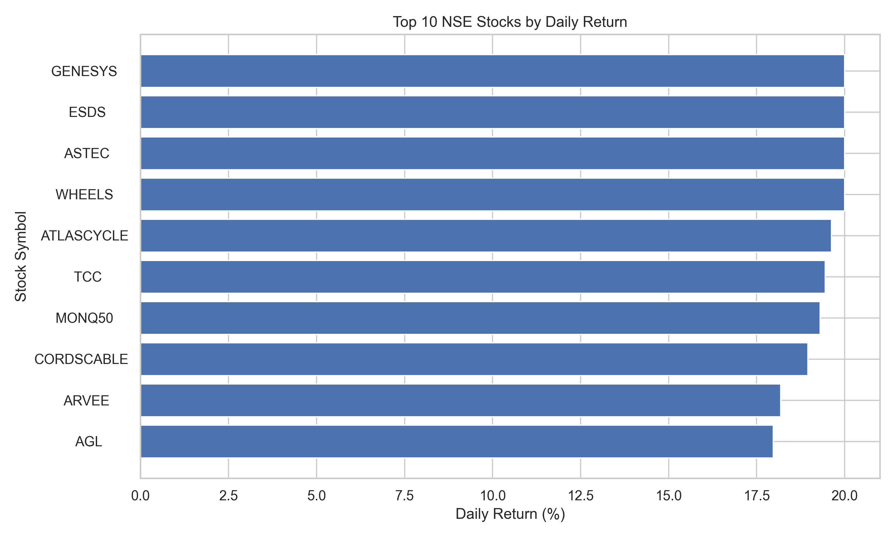
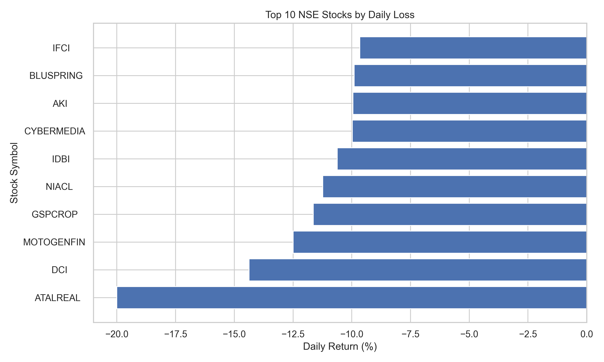
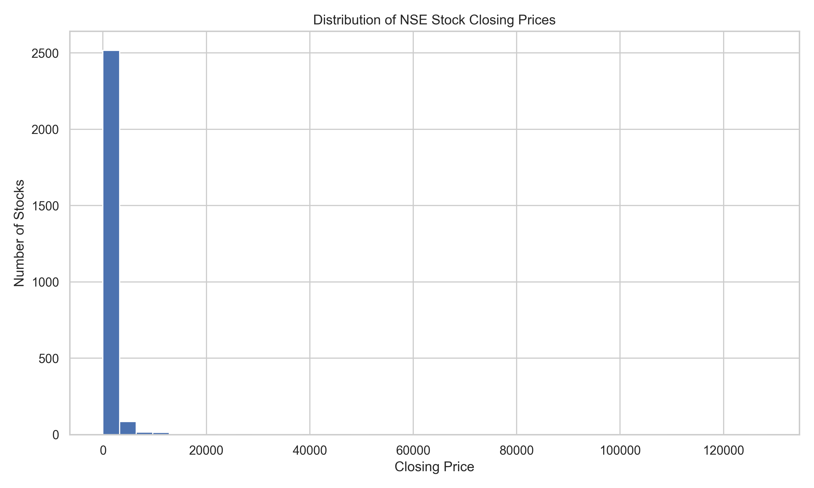
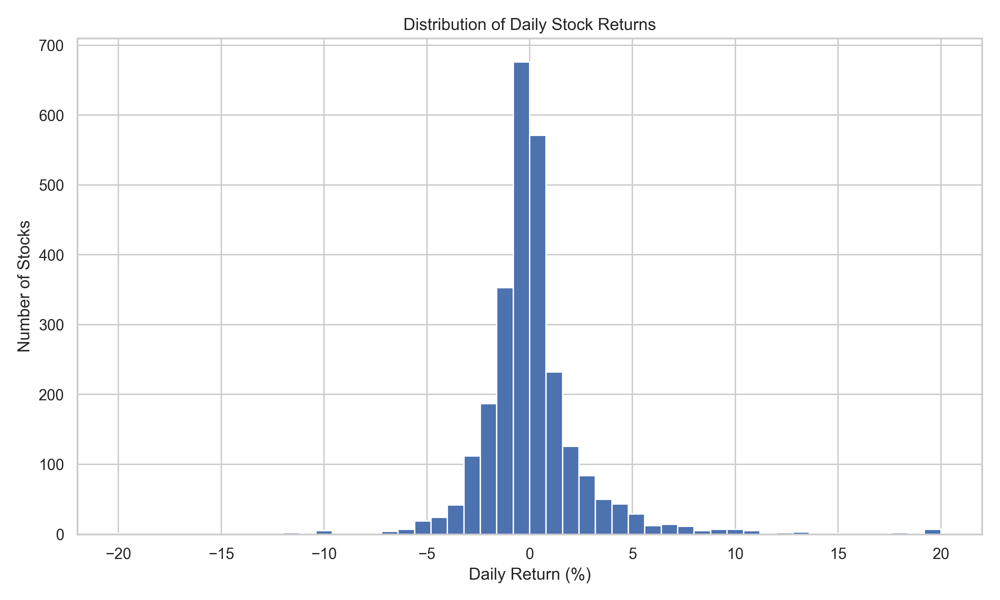
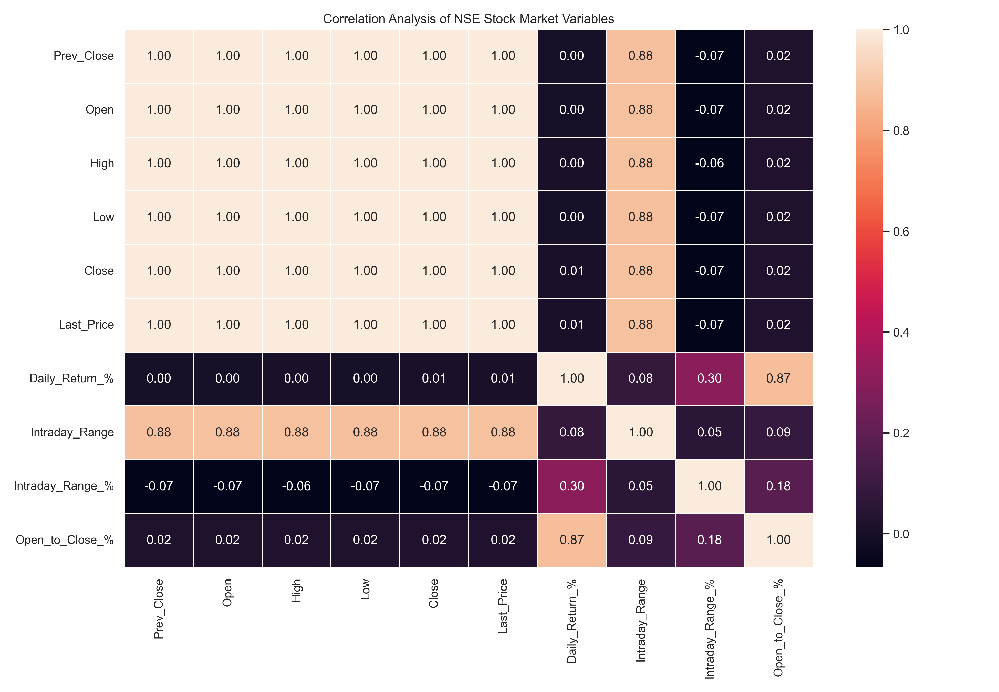
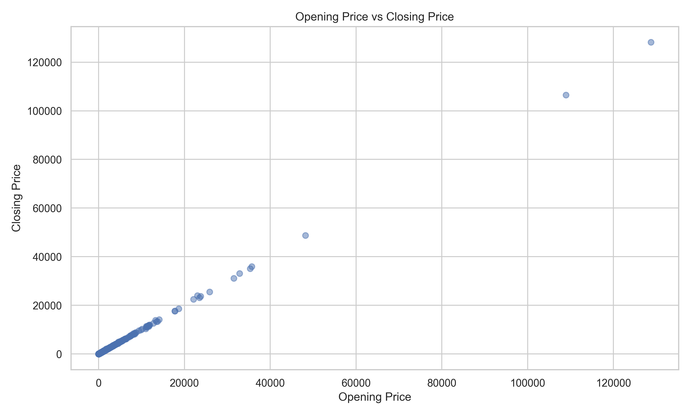
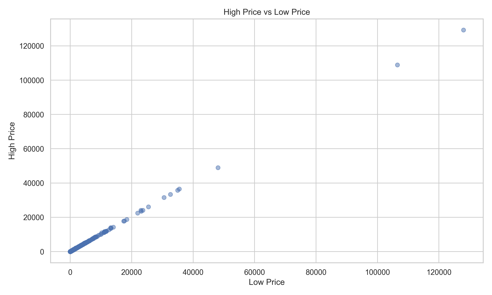

# 📈 NSE Stock Market Analytics

<p align="center">
  
</p>

<p align="center">
  <strong>Python • Pandas • NumPy • Matplotlib • Seaborn • Jupyter • Power BI • Git • GitHub</strong>
</p>

> A real-world stock market data analytics project using Python, Pandas, Matplotlib, Seaborn and Power BI, with Git & GitHub for project version control and documentation.

---

## 📌 Project Overview

The **NSE Stock Market Analytics** project analyzes real-world stock market data from the **National Stock Exchange of India (NSE)**.

The objective of this project is to inspect, clean, analyze and visualize stock market data and convert the results into meaningful business insights through **Python EDA** and an interactive **Power BI dashboard**.

This project covers the complete data analytics workflow:

**Data Collection → Data Cleaning → Exploratory Data Analysis → Visualization → Power BI Dashboard → Business Insights → Recommendations → GitHub Documentation**

---

## 🎯 Problem Statement

Stock market datasets contain a large number of companies and trading metrics such as:

- Previous Close
- Open Price
- High Price
- Low Price
- Closing Price
- Daily Returns
- Intraday Range
- Market Movement

Analyzing these values manually can make it difficult to identify important market patterns.

The goal of this project is to:

- Clean and prepare NSE stock market data
- Analyze stock price movements
- Identify top-performing and underperforming stocks
- Identify highly volatile stocks
- Understand relationships between OHLC prices
- Create meaningful visualizations
- Build an interactive Power BI dashboard
- Generate business-oriented insights and recommendations

---

# 📊 Dataset

### Source

The dataset is based on NSE market data for:

**Trade Date: 08 September 2026**

The raw NSE data was processed and converted into an analysis-ready CSV dataset.

### Dataset Size

- **Records:** 2,650 stocks
- **Columns:** 15
- **Market:** NSE India
- **Date:** 08-Sep-2026

---

## 📋 Dataset Columns

| Column | Description |
|---|---|
| `Trade_Date` | Date of trading |
| `Company_Name` | Company name |
| `Symbol` | NSE trading symbol |
| `Series` | Security series |
| `Market_Status` | Market status |
| `Prev_Close` | Previous closing price |
| `Open` | Opening price |
| `High` | Highest price during the day |
| `Low` | Lowest price during the day |
| `Close` | Closing price |
| `Last_Price` | Last traded price |
| `Daily_Return_%` | Percentage change from previous close |
| `Intraday_Range` | Difference between High and Low |
| `Intraday_Range_%` | Intraday movement as percentage of previous close |
| `Open_to_Close_%` | Percentage movement from Open to Close |

---

# 🛠️ Tools & Technologies

### Programming & Analysis

- 🐍 Python
- 🐼 Pandas
- 🔢 NumPy
- 📊 Matplotlib
- 📈 Seaborn
- 📓 Jupyter Notebook

### Business Intelligence

- 📊 Microsoft Power BI
- Power Query
- DAX

### Version Control

- 🔧 Git
- 🐙 GitHub

---

# 🔄 Project Workflow

```text
NSE Market Data
       ↓
Data Inspection
       ↓
Data Cleaning
       ↓
Data Transformation
       ↓
Exploratory Data Analysis
       ↓
Data Visualization
       ↓
Power BI Dashboard
       ↓
Business Insights
       ↓
Recommendations
       ↓
GitHub Documentation
```

---

# 🧹 Data Cleaning & Preparation

The raw NSE dataset was inspected and cleaned before analysis.

### Cleaning steps performed

- Converted the trading date into proper date format
- Converted price columns into numeric format
- Checked missing values
- Removed duplicate records
- Removed invalid records
- Removed non-positive price values
- Checked OHLC logical consistency
- Recalculated derived metrics
- Prepared the final analysis-ready dataset

### OHLC Validation

The following conditions were checked:

```text
High >= Open
High >= Close
High >= Low

Low <= Open
Low <= Close
Low <= High
```

This helped ensure that the price data was logically consistent.

---

# 🧮 Derived Metrics

Additional analytical columns were created to understand stock performance.

### 1. Daily Return

```text
Daily Return % =
((Close - Prev_Close) / Prev_Close) × 100
```

This measures the percentage change in a stock's closing price compared with the previous close.

### 2. Intraday Range

```text
Intraday Range =
High - Low
```

This represents the absolute price movement during the trading day.

### 3. Intraday Range %

```text
Intraday Range % =
((High - Low) / Prev_Close) × 100
```

This helps compare volatility between stocks with different price levels.

### 4. Open to Close %

```text
Open to Close % =
((Close - Open) / Open) × 100
```

This measures the price movement from the beginning to the end of the trading session.

---

# 🔎 Exploratory Data Analysis

The dataset was explored using Python and Pandas.

The analysis included:

- Dataset shape
- Column names
- Data types
- Missing values
- Duplicate records
- Descriptive statistics
- Price distribution
- Daily return analysis
- Top gainers
- Top losers
- Stock volatility
- Correlation analysis
- Outlier detection
- OHLC relationship analysis

---

# 📊 Statistical Analysis

Descriptive statistics were calculated for the major numerical columns.

The analysis included:

- Count
- Mean
- Standard deviation
- Minimum
- 25th percentile
- Median
- 75th percentile
- Maximum

These statistics were used to understand the overall distribution and behavior of NSE stocks.

---

# 📈 Visualizations

The project contains multiple visualizations created using Python.

## 1. Top 10 NSE Gainers

Identifies the stocks with the highest positive daily returns.



---

## 2. Top 10 NSE Losers

Identifies the stocks with the largest negative daily returns.



---

## 3. Closing Price Distribution

Shows how NSE stock closing prices are distributed across different price ranges.



---

## 4. Daily Return Distribution

Shows the distribution of daily percentage returns across the stocks.



---

## 5. Correlation Heatmap

Shows relationships between major stock price variables.



---

## 6. Open vs Close Price

Compares opening and closing prices across stocks.



---

## 7. High vs Low Price

Shows the relationship between the highest and lowest traded prices.



---

# 📊 Power BI Dashboard

An interactive **NSE Stock Market Dashboard** was developed using Microsoft Power BI.

The dashboard provides a quick overview of market performance and stock movements.

## 📌 KPI Cards

The dashboard contains the following key performance indicators:

### Total Stocks
Number of unique stocks included in the dataset.

### Positive Stocks
Number of stocks with positive daily returns.

### Negative Stocks
Number of stocks with negative daily returns.

### Average Closing Price
Average closing price across the analyzed stocks.

### Average Daily Return
Average daily percentage return across the market.

---

# 📊 Power BI Visuals

The dashboard includes:

### 1. Top 10 NSE Gainers
Displays stocks with the highest daily returns.

### 2. Top 10 NSE Losers
Displays stocks with the lowest daily returns.

### 3. Market Gainers vs Losers
Shows the overall distribution of:

- Gainers
- Losers
- No Change

### 4. NSE Stock Closing Price Distribution
Shows how closing prices are distributed across different price ranges.

### 5. Top 10 Most Volatile Stocks
Identifies stocks with the highest intraday price movement.

---

# 🎛️ Dashboard Interactivity

The Power BI dashboard supports interactive analysis using:

- Slicers
- Filters
- KPI cards
- Interactive charts
- Cross-filtering
- Tooltips

This allows users to explore the stock market data more easily.

---

# 💡 Business Insights

The analysis produced several important observations.

## 1. Market Performance Was Mixed

The market contained both positive and negative performers.

This indicates that stock-level performance varied significantly during the trading session rather than the entire market moving in one direction.

## 2. A Small Number of Stocks Experienced Large Price Movements

The top gainers and losers showed significantly higher daily returns compared with many other stocks.

This indicates that some individual stocks experienced strong market movements.

## 3. High Volatility Can Create Higher Risk

Stocks with larger intraday ranges experienced greater price movement during the trading session.

Highly volatile stocks may provide opportunities for traders but can also carry higher risk.

## 4. Closing Prices Were Concentrated in Lower Price Ranges

The closing-price distribution showed that many stocks were concentrated within relatively lower price ranges, while a smaller number of stocks had substantially higher prices.

## 5. OHLC Prices Show Strong Relationships

Open, High, Low and Close prices are naturally related because they describe different points of the same trading session.

The correlation analysis helps identify these relationships quantitatively.

## 6. Average Daily Return Was Relatively Small

The average daily return across the analyzed stocks was approximately:

**0.11%**

This indicates that although individual stocks experienced significant movements, the average movement across the complete dataset was comparatively small.

---

# 📌 Recommendations

Based on the analysis, the following recommendations can be made.

## 1. Monitor Highly Volatile Stocks

Investors and analysts should closely monitor stocks with unusually high intraday volatility.

These stocks can experience rapid price movements and therefore require stronger risk management.

## 2. Track Top Gainers and Losers

The top-performing and worst-performing stocks should be monitored regularly to identify unusual market movements.

## 3. Add Historical Data

Future versions of this project should include multiple trading days.

This would allow analysis of:

- Weekly trends
- Monthly trends
- Long-term performance
- Moving averages
- Volatility trends
- Market cycles

## 4. Add Sector-Level Analysis

Future analysis could classify stocks by sectors such as:

- Banking
- IT
- Energy
- Pharmaceuticals
- FMCG
- Automobile
- Financial Services

This would make it possible to compare sector performance.

## 5. Build Advanced Risk Metrics

Future versions could include:

- Standard deviation of returns
- Beta
- Sharpe ratio
- Maximum drawdown
- Rolling volatility

These metrics would provide deeper financial analysis.

---

# 📁 Project Structure

```text
NSE-Stock-Market-Analytics/
│
├── data/
│   ├── NSE_Stock_Market_Analytics_08Sep2026.csv
│   └── NSE_Stock_Market_Cleaned.csv
│
├── notebooks/
│   └── NSE_Stock_Market_Analytics_EDA.ipynb
│
├── visualizations/
│   ├── 01_top_10_gainers.png
│   ├── 02_top_10_losers.png
│   ├── 03_closing_price_distribution.png
│   ├── 04_daily_return_distribution.png
│   ├── 05_correlation_heatmap.png
│   ├── 06_open_vs_close.png
│   └── 07_high_vs_low.png
│
├── powerbi/
│   └── Nse Stock Market Dashboard.pbix
│
├── presentation/
│   └── NSE_Stock_Market_Presentation.pptx
│
├── NSE_Business_Insights_Report.pdf
├── README.md
└── .gitignore
```

---

# ▶️ How to Use This Project

## Step 1 — Clone the Repository

```bash
git clone https://github.com/aftabmonye/NSE-Stock-Market-Analytics.git
```

## Step 2 — Open the Project

Open the cloned project folder in:

- VS Code
- Jupyter Notebook
- Anaconda
- Any preferred Python environment

## Step 3 — Install Required Libraries

```bash
pip install pandas numpy matplotlib seaborn jupyter
```

## Step 4 — Open the Notebook

Open:

```text
notebooks/NSE_Stock_Market_Analytics_EDA.ipynb
```

Run the notebook cells from top to bottom.

## Step 5 — Explore the Power BI Dashboard

Open:

```text
powerbi/Nse Stock Market Dashboard.pbix
```

using Microsoft Power BI Desktop.

---

# 📄 Business Insights Report

A separate PDF report containing the business insights and recommendations is included in the repository.

```text
NSE_Business_Insights_Report.pdf
```

The report summarizes:

- Market performance
- Top gainers
- Top losers
- Volatility
- Price behavior
- Key observations
- Business recommendations

---

# 🔧 Git & GitHub Workflow

Git and GitHub were used to manage the project and maintain version history.

The workflow included:

```text
Initialize Repository
        ↓
Add Project Files
        ↓
Commit Changes
        ↓
Push to GitHub
        ↓
Update Project
        ↓
Commit Changes
        ↓
Push Changes
```

Example commands:

```bash
git status
git add .
git commit -m "Added project files"
git push
```

---

# 📚 Assignment Coverage

| Task | Requirement | Status |
|---|---|---|
| Task 1 | Git & GitHub Basics | ✅ Completed |
| Task 2 | Git Workflow Practice | ✅ Completed |
| Task 3 | Dataset Selection & Preparation | ✅ Completed |
| Task 4 | Exploratory Data Analysis | ✅ Completed |
| Task 5 | Data Visualization | ✅ Completed |
| Task 6 | Power BI Dashboard | ✅ Completed |
| Task 7 | Business Insights & Recommendations | ✅ Completed |
| Task 8 | GitHub Documentation & Presentation | ✅ Completed |


---

# ⚠️ Project Limitation

This project analyzes NSE data for a single trading date:

**08 September 2026**

Therefore, the analysis represents a **single-day market snapshot** rather than a long-term market trend.

Future versions should include multiple dates to perform time-series analysis and identify long-term patterns.

---

# 🚀 Future Improvements

The project can be further improved by adding:

- Automated NSE data collection
- Multiple trading dates
- Historical trend analysis
- Sector-wise performance
- Moving averages
- Technical indicators
- Volatility analysis
- Risk metrics
- Automated Power BI refresh
- Stock screening
- Advanced financial dashboards
- Predictive analytics

---

# 🎓 Skills Demonstrated

This project demonstrates practical knowledge of:

- Data Collection
- Data Cleaning
- Data Preparation
- Exploratory Data Analysis
- Statistical Analysis
- Data Visualization
- Python
- Pandas
- NumPy
- Matplotlib
- Seaborn
- Power BI
- Power Query
- DAX
- Business Intelligence
- Business Insights
- Data Storytelling
- Git
- GitHub
- Project Documentation

---

# 🏁 Conclusion

The **NSE Stock Market Analytics** project demonstrates an end-to-end data analytics workflow using real-world stock market data.

The project transforms raw NSE data into a structured dataset, performs exploratory analysis, creates meaningful visualizations, develops an interactive Power BI dashboard, and converts analytical results into business insights and recommendations.

This project helped demonstrate how data analytics tools can be combined to turn raw financial data into useful information for decision-making.

---

# 👨‍💻 Author

**Aftab Monye**

Aspiring Data Analyst

### Skills

**Excel • SQL • Power BI • Tableau • Python • Data Analytics • Git & GitHub**

---

## ⭐ If you found this project useful

Feel free to explore the repository, review the analysis, and provide feedback.

---

### 🔗 Project Repository

**NSE Stock Market Analytics**

https://github.com/aftabmonye/NSE-Stock-Market-Analytics
